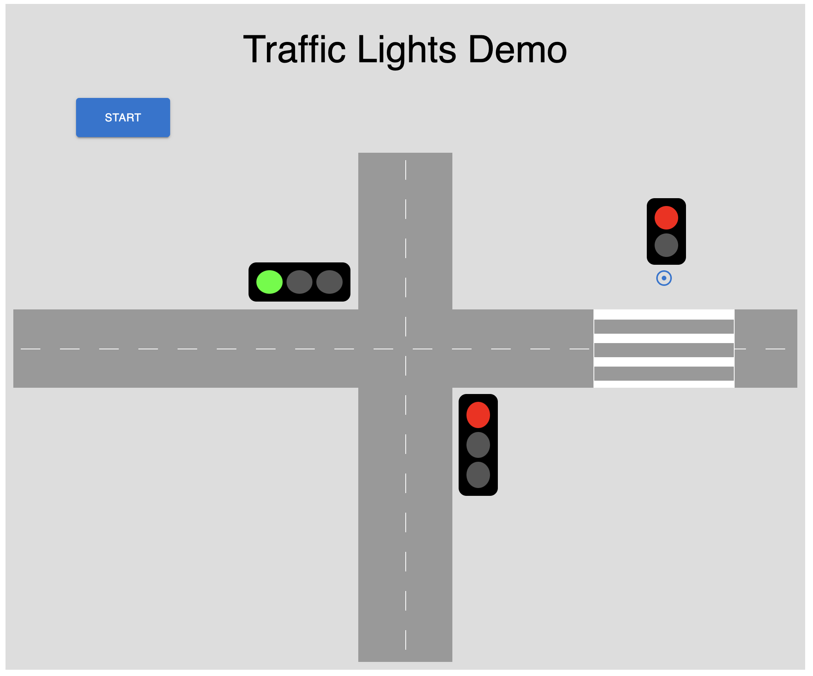

# Aufgabe: Verkehrsampel

## Get Started

```bash
npm install

npm run build

npm run start
 ```

## Demo link
https://street-intersection.netlify.app/

## CI/CD
erfolgt über die Platform https://www.netlify.com/

##  Entwerfen sie eine Verkehrsregelungsanlage

die Hauptstraße ist im Anfangszustand auf freie Fahrt geschaltet, die Nebenstraße auf halt, der Fußgängerüberweg auf Stehen
die Nebenstraße bekommt 5 Sekunden grün
die Nebenstraße kann freie Fahrt anfordern, wenn ein Fahrzeug an der Haltelinie steht
Fußgänger müssen immer die Gehberechtigung anfragen
die Fußgänger Ampel schaltet zwischen rot und grün. Grünphase: 5 Sekunden
Die Verkehrsampel schaltet über gelb nach rot, und von Rot mit gleichzeitigem leuchten von gelb auf grün.

## Verkehrsampel Schaltzeiten:

- Rot 2s
- gelb 1s
- rot-gelb 2s
- Übergangszeit 1s

